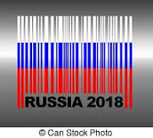
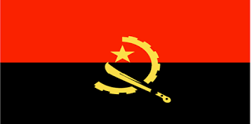

<html>
	<head>
		<title>Bein Sports 1 HD</title>
		<meta name="keywords" content="bein sports,bein,bein sports channels,free iptv channels,free iptv,live sending,confederations cup,confederations cup 2017,Rusia 2017 confederations cup,live streams,confederations cup live,bein live stream,bein confederations cup live." />
	</head>
	<body>

							
<!--<section>
								<header>
									<h1> Bein Sports 1 HD</h1>
									Futbol, tenis, basquetbol, handbol, formula 1, moto GP
									
stream url for vlc-player: 

								</header>
								http://93.174.93.84:8081/live/bein1-hq/playlist.m3u8?wmsAuthSign=c2VydmVyX3RpbWU9Ny8xOS8yMDE3IDEwOjUzOjU3IEFNJmhhc2hfdmFsdWU9NCtYYlN1S0lMMEpMRk5iaHhpMVhZdz09JnZhbGlkbWludXRlcz02MCZpZD0xNjIuMTU4LjEzNC43MiZzdHJtX2xlbj0xMw==

								

							--><section>
								<h3>Global Options</h3>
								<form action="#" method="get">
									<label>Language
										<select name="lang">
											<option value="cs">Čeština / Czech (cs)</option>
											<option value="de">Deutsch / German (de)</option>
											<option value="en" selected>English (en)</option>
											<option value="es">Español / Spanish; Castilian (es)</option>
											<option value="fa">فارسی / Persian (fa)</option>
											<option value="fr">Français / French (fr)</option>
											<option value="hr">Hrvatski / Croatian (hr)</option>
											<option value="hu">Magyar / Hungarian (hu)</option>
											<option value="it">Italiano / Italian (it)</option>
											<option value="ja">日本語 / Japanese (ja)</option>
											<option value="ko">한국어 / Korean (ko)</option>
											<option value="nl">Nederlands / Dutch (nl)</option>
											<option value="pl">Polski / Polish (pl)</option>
											<option value="pt">Português / Portuguese (pt)</option>
											<option value="pt-BR">Português / Portuguese (BR) (pt-BR)</option>
											<option value="ro">Română / Romanian (ro)</option>
											<option value="ru">Русский / Russian (ru)</option>
											<option value="sk">Slovensko / Slovak (sk)</option>
											<option value="sv">Svenska / Swedish (sv)</option>
											<option value="uk">Українська / Ukrainian (uk)</option>
											<option value="zh-CN">简体中文 / Simplified Chinese (zh-CN)</option>
											<option value="zh">繁体中文 / Traditional Chinese (zh-TW)</option>
										</select>
									</label>
									<label>Stretching (Video Only)
										<select name="stretching">
											<option value="none" selected>None (original dimensions) (default)</option>
											<option value="none">Responsive</option>
											<option value="none">Fill</option>
											<option value="none">Auto</option>
										</select>
									</label>
								</form>
							</section>
								<!--

-->
								<!--
-->
								

									<h3></h3>
									<table>
										<tbody>
											<tr>
												<td width="21" background="images/12421152032.png" height="13"></td>
												<td background="images/55452124552.png" height="13"></td>
												<td width="21" background="images/45454787.png" height="13"></td>
											</tr>

											<tr>
												<td width="21" background="images/21210212120.png"></td>
												<td>
													

														

															<video id="player1" autoplay="true" autostart="true" width="640" height="360" style="max-width:100%;" preload="http://93.174.93.84:8081/live/bein4-hq/playlist.m3u8?wmsAuthSign=c2VydmVyX3RpbWU9Ny8yMC8yMDE3IDc6Mzg6MjcgQU0maGFzaF92YWx1ZT1SVEx1N29scGdDL0MwTmE0cmwwMnJnPT0mdmFsaWRtaW51dGVzPTYwJmlkPTE2Mi4xNTguMTM0LjcyJnN0cm1fbGVuPTEz" controls>
																<source src="http://93.174.93.84:8081/live/bein4-hq/playlist.m3u8?wmsAuthSign=c2VydmVyX3RpbWU9Ny8yMC8yMDE3IDc6Mzg6MjcgQU0maGFzaF92YWx1ZT1SVEx1N29scGdDL0MwTmE0cmwwMnJnPT0mdmFsaWRtaW51dGVzPTYwJmlkPTE2Mi4xNTguMTM0LjcyJnN0cm1fbGVuPTEz" type="video/hls">  <!--http://asno.gcdn.co/bn-sp-1-hd/index.m3u8-->
															</video>
														

													

												</td>
												<td width="21" background="images/203233451.png"></td>
											</tr>
											<tr>
												<td width="21" background="images/23121542.png" height="17"></td>
												<td background="images/12345456.png" height="17"></td>
												<td width="21" background="images/2656564.png" height="25"></td>
											</tr>

										</tbody>
									</table>
									 
								

								 
								

								 
								<!--   interactivo   -->
								

									<tr>
										<td >
				 		
La Copa Confederaciones se celebra un año antes del mundial en la casa del anfitriòn del próximo mundial. Asimismo como
   el nombre lo indica intervienen los ganadores de las seis confederaciones que conforman la FIFA, a saber: Oceanía, Asia,
   Africa, Europa, Sudamerica y Norteamerica Centralamerica y Caribe. El mundial 2018 y la Copa Confederaciones 2017 tendrán por
   anfitrión a Rusia. Además de los actuales monarcas de las seis confederaciones de FIFA: Nueva Zelandia (Oceanía), Australia
   (Asia), Camerún (Africa), Chile (Sudamerica), Portugal (Europa) participan del Torneo de las Federaciones 2017, el actual
   campeón del mundo (Alemania) y el anfitrión del próximo mundial (Rusia) como quedo dicho anteriormente.

Los grupos son dos con 4 países c/u

<td>Horarios: <code>Próximo partido</code>: sábado 17-19h <a href="https://www.google.nl/search?q=google&rlz=1C1GCEA_enSE747SE747&oq=google&aqs=chrome..69i57j0l2j69i60l3.3256j0j8&sourceid=chrome&ie=UTF-8#q=google&p2p=1">Rusia - Nueva Zelandia</a></td><td><a href="https://www.google.nl/search?q=google&rlz=1C1GCEA_enSE747SE747&oq=google&aqs=chrome..69i57j0l2j69i60l3.3256j0j8&sourceid=chrome&ie=UTF-8#q=google&p2p=1"></a></td><td><a href="//acestream.org">[ace plugin]</a></td><td><a href="//awe.acestream.me/scripts/acestream/P2P_Search">[p2p search]</a></td>
									</td>	
									</tr>
									
								

								 
								
<tr style="border-color:#000;"><td></td><td></td><td>-IPTV</td><tr>
								
						

						